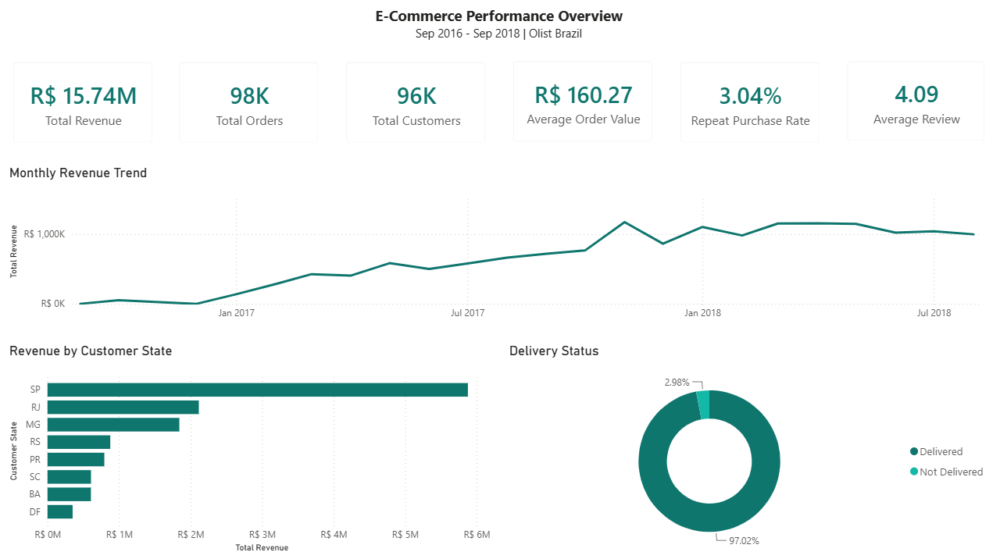
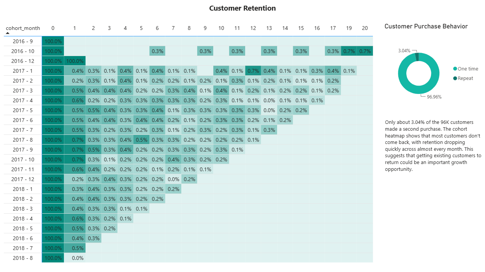

# E-Commerce Customer Retention & Revenue Analysis

**A full-cycle analytics project using the Olist Brazilian e-commerce dataset, from raw data cleaning to SQL analysis, Power BI dashboards, and a business memo.**

This project goes beyond building a dashboard. I documented the main data cleaning decisions, validated the SQL results against Power BI measures, and turned the findings into a short business memo for a non-technical stakeholder.

[Live dashboard/screenshots](dashboard/) · [Business memo](MEMO.md) · [Cleaning notebook](notebook/) · [SQL queries](sql/)

## The business question

**Olist is bringing in new customers, but very few of them come back. What's happening with customer retention, and what could the business do about it?**

The analysis covers two years of order data (Sep 2016 – Aug 2018) and found a repeat purchase rate of just **3.04%**. The pattern is consistent across most customer cohorts, suggesting that low repeat purchases are not limited to a particular period.

Revenue is growing, but the business relies heavily on bringing in new customers rather than getting existing customers to return.

## What this project demonstrates

| Skill                        | Where it shows up                                                                                                                                    |
| ---------------------------- | ---------------------------------------------------------------------------------------------------------------------------------------------------- |
| **Data cleaning & analysis** | Distinguished `customer_id` from `customer_unique_id`, investigated missing dates, identified duplicate reviews, and checked unusual payment records |
| **SQL**                      | Built queries for cohort retention, revenue by state, repeat purchase rate, and AOV trends using joins, CTEs, and aggregations                       |
| **DAX / Power BI**           | Built an executive dashboard with KPI cards, revenue trends, revenue by state, and a customer retention heatmap                                      |
| **Data quality**             | Excluded September 2018 because it was only a partial month and excluded very small early cohorts from the retention trend                           |
| **Business communication**   | Turned the analysis into a one-page memo with clear findings and recommendations for a non-technical stakeholder.                                    |

## Key findings

- **Repeat purchase rate: 3.04%**. Only a small share of customers placed a second order
- **Most customers don't return**. The biggest drop happens after the first purchase
- **São Paulo generates about one-third of total revenue**. Making it a good place to start testing a retention strategy
- **Revenue reached R$15.74M, with an AOV of R$160.27**. Growth depends heavily on acquiring new customers

The detailed findings, recommendations, and analysis limitations are explained in [`MEMO.md`](MEMO.md).

## Dashboard

**Performance Overview**: KPIs, monthly revenue trend, revenue by customer state, delivery status



**Customer Retention**: Cohort retention heatmap, customer purchase behavior



## Tech stack

- **Python (Google Colab):** Data cleaning and exploratory analysis
- **PostgreSQL:** Joins, cohort analysis, revenue analysis, and aggregations
- **Power BI Desktop:** Dashboard and DAX measures
- **Dataset:** [Olist Brazilian E-Commerce dataset](https://www.kaggle.com/datasets/olistbr/brazilian-ecommerce) (Kaggle)

## Repo structure

```text
ecommerce-retention-analysis/
├── notebook/          # Python cleaning & EDA
├── sql/               # PostgreSQL queries
├── dashboard/         # Power BI file + screenshots
├── MEMO.md            # Business recommendation memo
└── README.md
```

The raw data is not included in this repo. Download it from [Kaggle](https://www.kaggle.com/datasets/olistbr/brazilian-ecommerce) and place it in the `data/` folder if you want to reproduce the analysis.

## About me

**Siti Suharyanti** - Junior Data Analyst based in Indonesia, open to remote and international opportunities.

More projects: [Portfolio](https://github.com/SitiSuharyanti/Data-Analyst-Portfolio) · [LinkedIn](https://linkedin.com/in/sitisuharyanti/) · [Email](siti.suharyanti2001@gmail.com)
